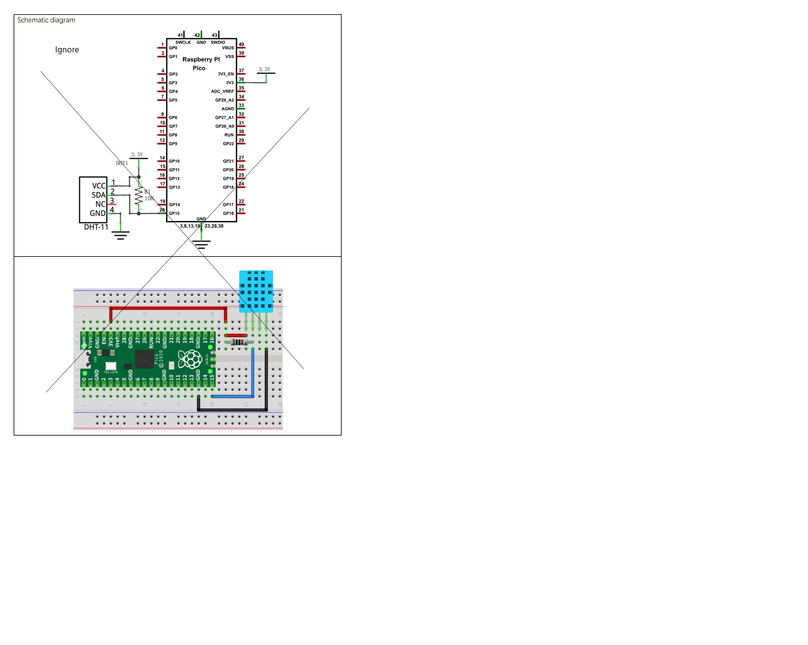

# Azure IoT Hub RPI Pico BME280

-   [Getting Started](#Getting-Started)
    
-   [Setup for the BME280](#Setup-for-the-DHT11)

## About

This example addes a BME280 Temperature-Pressure-Humidity Sensor to generate real Telemetry data.

> Nb: THe SDK API is documented [here](https://azuresdkdocs.blob.core.windows.net/$web/c/az_iot/1.1.0-beta.2/index.html)

## Getting Started

- Get the Pico sending some simulated data as per the Base project ReadMe.

## Setup for the BME280
- Setup the WiFi and Azure IoT Hub connection in iot_configs.h as per the Base._ 
- Add this BME280 library:
  - Search for BME280
    - Select and install the one by Tyler Glenn
- Pico Pin 4 to SDA on BME280
- Pico Pin 5 to SDI on BME280
- Add The ArduinoJson Library:
  - Ref: https://arduinojson.org/
  - In the Arduino Library Manager search for “ArduinoJson”
  - Select and install.
- Verify the code

## Circuit




Ref: Freenove ```./C/C_Tutorial.pdf``` document (in repository) 

## Running
- Upload then switch to the Serial Monitor.
- You should see something like:
```
.........WiFi connected, IP address: 192.168.0.14
Setting time using SNTP......done!
Current time: Sun Jan  1 04:30:55 2023
Client ID: PicoDev137
Username: PicoHub137.azure-devices.net/PicoDev137/?api-version=2020-09-30&DeviceClientType=c%2F1.5.0-beta.1(ard;rpipico)
MQTT connecting ... connected.
11352 RPI Pico (Arduino) Sending telemetry . . . OK
14052 RPI Pico (Arduino) Sending telemetry . . . OK
16947 RPI Pico (Arduino) Sending telemetry . . . OK
```

## Monitor Telemetry

### In a Terminal
- In a desktop terminal context that has AzureCli with the IoT Extensiomn installed (See Base ReadMe):  
```
az iot hub monitor-events --login <your Azure IoT Hub owner connection string in quotes> --device-id <your device id>
```

```
{
    "event": {
        "origin": "PicoDev137",
        "module": "",
        "interface": "",
        "component": "",
        "payload": "{\"msgCount\":163,\"temp\":31.2,\"humidity\":45}"
    }
}
{
    "event": {
        "origin": "PicoDev137",
        "module": "",
        "interface": "",
        "component": "",
        "payload": "{\"msgCount\":164,\"temp\":31.2,\"humidity\":45}"
    }
}
{
    "event": {
        "origin": "PicoDev137",
        "module": "",
        "interface": "",
        "component": "",
        "payload": "{\"msgCount\":165,\"temp\":31.2,\"humidity\":44}"
    }
}
```

### In VS Code
- Add the Azure IoT Hub Extension
- Add The IoT Hub [Select and IoT Hub] and follow the directions.
  - You need to select the Subscription 
  - You will be prompted for connefction details
  - Then select the Hub
- In the left pane select the hub then the device.
- Right click on that and select "Start Monitoring Built-In Endpoint"

```
[IoTHubMonitor] [3:40:22 PM] Message received from [PicoDev137]:
{
  "msgCount": 216,
  "temp": 31.2,
  "humidity": 44
}
[IoTHubMonitor] [3:40:25 PM] Message received from [PicoDev137]:
{
  "msgCount": 217,
  "temp": 31.2,
  "humidity": 44
}
[IoTHubMonitor] [3:40:28 PM] Message received from [PicoDev137]:
{
  "msgCount": 218,
  "temp": 31.2,
  "humidity": 44
}
```

## Code

### Declarations

```c
// Sensors etc
#include <BME280I2C.h>
#include <Wire.h>
BME280I2C::Settings settings(
   BME280::OSR_X1,
   BME280::OSR_X1,
   BME280::OSR_X1,
   BME280::Mode_Forced,
   BME280::StandbyTime_1000ms,
   BME280::Filter_Off,
   BME280::SpiEnable_False,
   //BME280I2C::I2CAddr_0x76 
   BME280I2C::I2CAddr_0x77
);
//BME280I2C bme;    // Default : forced mode, standby time = 1000 ms
                  // Oversampling = pressure �1, temperature �1, humidity �1, filter off,

//////////////////////////////////////////////////////////////////
BME280I2C bme(settings);
#include <ArduinoJson.h>
```

### hwSetup()
Called from Setup()

```c
void hwSetup()
{
  while (!Serial){}

  Wire.begin();

  while(!bme.begin())
  {
    Serial.println("Could not find BME280 sensor!");
    delay(1000);
  }

  switch(bme.chipModel())
  {
     case BME280::ChipModel_BME280:
       Serial.println("Found BME280 sensor! Success.");
       break;
     case BME280::ChipModel_BMP280:
       Serial.println("Found BMP280 sensor! No Humidity available.");
       break;
     default:
       Serial.println("Found UNKNOWN sensor! Error!");
  }
}
```

### getTelemetryPayload()

```c
DynamicJsonDocument doc(1024);
char jsonStr[128]; // Meeded to bigger as more data
char ret[64];

static char* getTelemetryPayload()
{
  bool chk = ReadSensor(); // See below
  if (chk) {
    doc["msgCount"]   = telemetry_send_count ++;
    doc["temperature"]   = temperature;
    doc["humidity"]   = humidity;
    doc["pressure"]   = pressure;
    serializeJson(doc, jsonStr);
    az_span temp_span = az_span_create_from_str(jsonStr);
    az_span_to_str((char *)telemetry_payload, sizeof(telemetry_payload), temp_span);
  }
  else
    telemetry_payload[0] = 0;
  return (char*)telemetry_payload;
}
```

### ReadSensor() separates out Sensor code:

```c
double temperature(NAN), humidity(NAN), pressure(NAN);

static bool ReadSensor()
{
  Stream* client = &Serial;
   float temp(NAN), hum(NAN), press(NAN);

   BME280::TempUnit tempUnit(BME280::TempUnit_Celsius);
   BME280::PresUnit presUnit(BME280::PresUnit_Pa);

   bme.read(press, temp, hum, tempUnit, presUnit);
   
   //ArduinoJson requires double not float as get extra spurious dps
   temperature = Round4Places(temp);
   pressure = Round4Places(press);   
   humidity = Round4Places(hum);

   return true;
}
```
