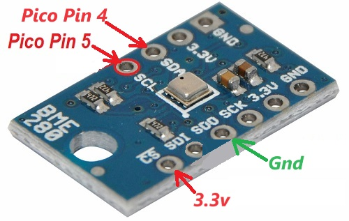
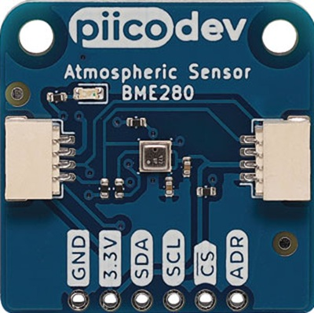
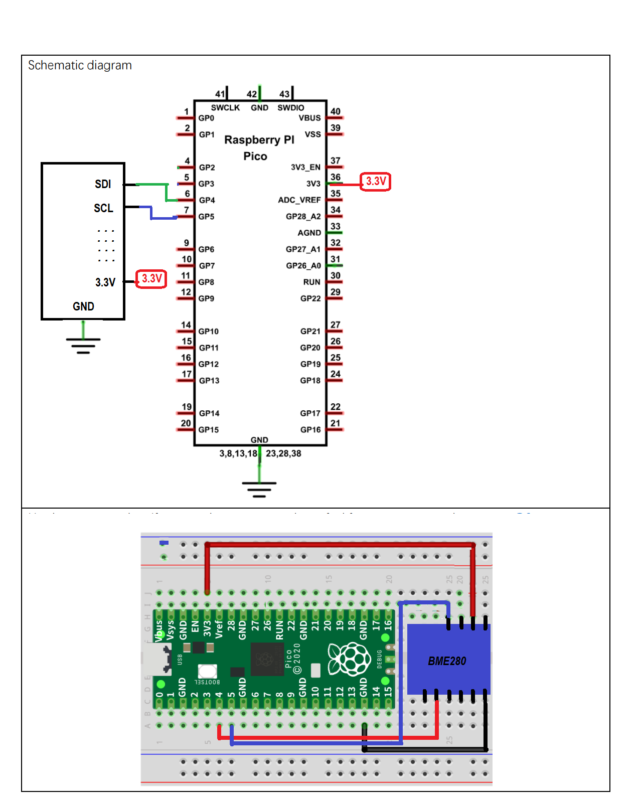

# Azure IoT Hub RPI Pico BME280 with CDM

### This BME280 version has Direct Methods and Device Twins
- Update: Telemetry is 90% generic. Just add/remove in list in iot_configs.h_


-   [Getting Started](#Getting-Started)
    
-   [Setup for the BME280](#Setup-for-the-DHT11)

## About

This example addes a BME280 Temperature-Pressure-Humidity Sensor to generate real Telemetry data.

> Nb: THe SDK API is documented [here](https://azuresdkdocs.blob.core.windows.net/$web/c/az_iot/1.1.0-beta.2/index.html)

## Getting Started

- Get the Pico sending some simulated data as per the Base project ReadMe.

> Updated 24/12/2023



> Upon revisting this, found needed corection to connections from previous:

- Using [Altronics Z6455](https://www.altronics.com.au/p/z6455-bme280-temperature-humidity-pressure-sensor/)
  - Pico ----- BME280
  - 3.3V ----- VCC _(There are 2. Only one needs connection)_
  - GND  ----- GND _(There are 2. Only one needs connection)_
  - Pico Pin 4
    - SDA  ----- SDA
  - Pico Pin 5
    - SCL  ----- SCL
  - 3.3V ----- CSB (enables the I2C interface)
  - GND  ----- SDO (I2C Address 0x76)
  - 3.3V ----- SDO (I2C Address 0x77)
  - NC&nbsp;&nbsp;&nbsp;----- SCK
  - NC&nbsp;&nbsp;&nbsp;----- SDI  
  _NC: No connection_

### Alternative Device

> Alternative devices are locked into using I2C rather than SPI and therefore, as a package, have less pins.

For example, the [Altronics PiicoDev BME280 Atmospheric Sensor](https://www.altronics.com.au/p/z6581-picodev-BME280-atmospheric-sensor-board/):



- Besides solderable pins, this has the [Qwiic 4 pin connector](https://www.sparkfun.com/qwiic)
  - Black GND
  - Red Vcc
  - Blue SDA _Cf White for Grove connector_
  - Yellow SCL
- Note that its default address is 0x77 but is onboard switchable to 0x75
- Further info: [https://piico.dev/p2](https://piico.dev/p2)  

----

- Setup the WiFi and Azure IoT Hub connection in iot_configs.h as per the Base._ 
- Add this BME280 library:
  - Search for BME280
    - Select and install the one by Tyler Glenn
- Add The ArduinoJson Library:
  - Ref: https://arduinojson.org/
  - In the Arduino Library Manager search for “ArduinoJson”
  - Select and install.
- Verify the code

## Circuit

 

Ref: Freenove ```./C/C_Tutorial.pdf``` document (in repository) 

## Running
- Upload then switch to the Serial Monitor.
- You should see something like:
```
1752934 RPI Pico (Arduino) Sending telemetry . . . 
Temperature: 20.64�C		Humidity: 62.61% RH		Pressure: 100975.83Pa
{"msgCount":679,"temperature":20.64,"humidity":62.6064,"pressure":100975.8281}
OK
1755698 RPI Pico (Arduino) Sending telemetry . . . 
Temperature: 20.65�C		Humidity: 62.63% RH		Pressure: 100974.90Pa
{"msgCount":680,"temperature":20.65,"humidity":62.6309,"pressure":100974.8984}
OK
1758398 RPI Pico (Arduino) Sending telemetry . . . 
Temperature: 20.64�C		Humidity: 62.63% RH		Pressure: 100974.94Pa
{"msgCount":681,"temperature":20.64,"humidity":62.6279,"pressure":100974.9375}
OK
```

## Monitor Telemetry

### In Azure IoT Explorer
```
Wed Mar 01 2023 12:06:41 GMT+1100 (Australian Eastern Daylight Time):
{
  "body": {
    "msgCount": 683,
    "temperature": 20.65,
    "humidity": 62.6289,
    "pressure": 100976.6875
  },
  "enqueuedTime": "Wed Mar 01 2023 12:06:41 GMT+1100 (Australian Eastern Daylight Time)",
  "properties": {}
}
Wed Mar 01 2023 12:06:39 GMT+1100 (Australian Eastern Daylight Time):
{
  "body": {
    "msgCount": 682,
    "temperature": 20.64,
    "humidity": 62.6406,
    "pressure": 100981.1172
  },
  "enqueuedTime": "Wed Mar 01 2023 12:06:39 GMT+1100 (Australian Eastern Daylight Time)",
  "properties": {}
}
```

### In a Terminal
- In a desktop terminal context that has AzureCli with the IoT Extensiomn installed (See Base ReadMe):  
```
az login
```
...first, then.... 
``` 
az iot hub monitor-events -n <your hub name>
```

```
{
    "event": {
        "origin": "PicoDev7",
        "module": "",
        "interface": "",
        "component": "",
        "payload": "{\"msgCount\":164,\"temperature\":22.62,\"humidity\":56.1025,\"pressure\":100862.1328}"
    }
}
{
    "event": {
        "origin": "PicoDev7",
        "module": "",
        "interface": "",
        "component": "",
        "payload": "{\"msgCount\":165,\"temperature\":22.62,\"humidity\":56.0801,\"pressure\":100859.4844}"
    }
}
{
    "event": {
        "origin": "PicoDev7",
        "module": "",
        "interface": "",
        "component": "",
        "payload": "{\"msgCount\":166,\"temperature\":22.62,\"humidity\":56.1025,\"pressure\":100867.4375}"
    }
}
```

### In VS Code
- Add the Azure IoT Hub Extension
- Add The IoT Hub [Select and IoT Hub] and follow the directions.
  - You need to select the Subscription 
  - You will be prompted for connefction details
  - Then select the Hub
- In the left pane select the hub then the device.
- Right click on that and select "Start Monitoring Built-In Endpoint"

```
IoTHubMonitor] [3:43:55 PM] Message received from [PicoDev7]:
{
  "msgCount": 343,
  "temperature": 22.43,
  "humidity": 56.915,
  "pressure": 100860.5313
}
[IoTHubMonitor] [3:43:57 PM] Message received from [PicoDev7]:
{
  "msgCount": 344,
  "temperature": 22.43,
  "humidity": 56.916,
  "pressure": 100871.9922
}
[IoTHubMonitor] [3:43:59 PM] Message received from [PicoDev7]:
{
  "msgCount": 345,
  "temperature": 22.42,
  "humidity": 56.915,
  "pressure": 100870.2891
}
```

## Code

### Declarations

```c
// Sensors etc
#include <BME280I2C.h>
#include <Wire.h>
BME280I2C::Settings settings(
   BME280::OSR_X1,
   BME280::OSR_X1,
   BME280::OSR_X1,
   BME280::Mode_Forced,
   BME280::StandbyTime_1000ms,
   BME280::Filter_Off,
   BME280::SpiEnable_False,
   //BME280I2C::I2CAddr_0x76 
   BME280I2C::I2CAddr_0x77
);
//BME280I2C bme;    // Default : forced mode, standby time = 1000 ms
                  // Oversampling = pressure �1, temperature �1, humidity �1, filter off,

//////////////////////////////////////////////////////////////////
BME280I2C bme(settings);
#include <ArduinoJson.h>
```

### hwSetup()
Called from Setup()

```c
void hwSetup()
{
  while (!Serial){}

  Wire.begin();

  while(!bme.begin())
  {
    Serial.println("Could not find BME280 sensor!");
    delay(1000);
  }

  switch(bme.chipModel())
  {
     case BME280::ChipModel_BME280:
       Serial.println("Found BME280 sensor! Success.");
       break;
     case BME280::ChipModel_BMP280:
       Serial.println("Found BMP280 sensor! No Humidity available.");
       break;
     default:
       Serial.println("Found UNKNOWN sensor! Error!");
  }
}
```

### getTelemetryPayload()

```c
DynamicJsonDocument doc(1024);
char jsonStr[128]; // Meeded to bigger as more data
char ret[64];

static char* getTelemetryPayload()
{
  bool chk = ReadSensor(); // See below
  if (chk) {
    doc["msgCount"]   = telemetry_send_count ++;
    doc["temperature"]   = temperature;
    doc["humidity"]   = humidity;
    doc["pressure"]   = pressure;
    serializeJson(doc, jsonStr);
    az_span temp_span = az_span_create_from_str(jsonStr);
    az_span_to_str((char *)telemetry_payload, sizeof(telemetry_payload), temp_span);
  }
  else
    telemetry_payload[0] = 0;
  return (char*)telemetry_payload;
}
```

### ReadSensor() separates out Sensor code:

```c
double temperature(NAN), humidity(NAN), pressure(NAN);

static bool ReadSensor()
{
  Stream* client = &Serial;
   float temp(NAN), hum(NAN), press(NAN);

   BME280::TempUnit tempUnit(BME280::TempUnit_Celsius);
   BME280::PresUnit presUnit(BME280::PresUnit_Pa);

   bme.read(press, temp, hum, tempUnit, presUnit);
   
   //ArduinoJson requires double not float as get extra spurious dps
   temperature = Round4Places(temp);
   pressure = Round4Places(press);   
   humidity = Round4Places(hum);

   return true;
}
```
