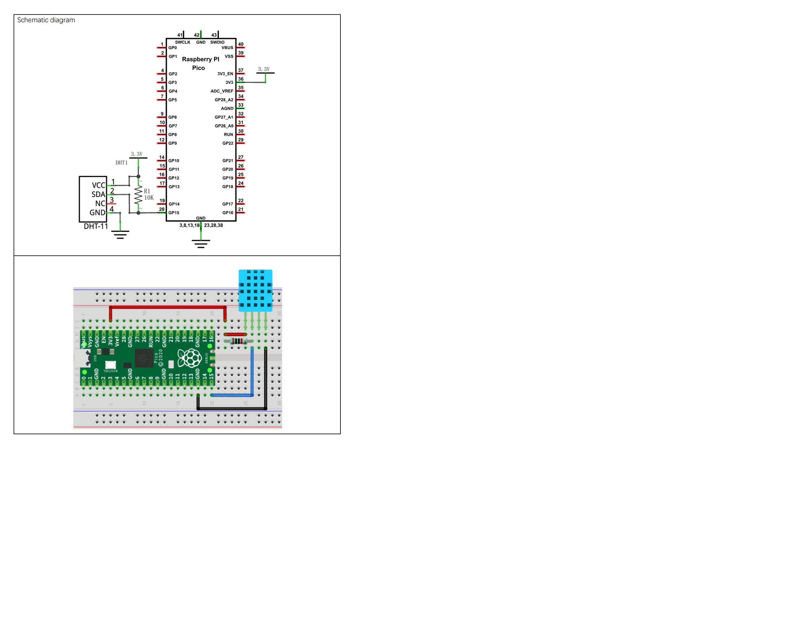

# Azure IoT Hub RPI Pico Thermistor

-   [Getting Started](#Getting-Started)
    
-   [Setup for the DHT11](#Setup-for-the-DHT11)

## About

This example addes a DHT11 Temperature-Pressure Sensor to geneerate real Telemetry data.

> Nb: THe SDK API is documented [here](https://azuresdkdocs.blob.core.windows.net/$web/c/az_iot/1.1.0-beta.2/index.html)

## Getting Started

- Get the Pico sending some simulated data as per the Base project ReadMe.

## Setup for the DHT11
- Setup the WiFi and Azure IoT Hub connection in iot_configs.h as per the Base._ 
- Add this DHT11 library:
  - As previuosly mentioned, the FrenoveStarter Kit for the Rpi Pico was used:
    - Clone the repoitory https://github.com/Freenove/Freenove_Ultimate_Starter_Kit_for_Raspberry_Pi_Pico
  - Open Arduino>Sketch>Include Library>Add .ZIP Library...
  - Starting at the root of the clone locally, select the provided```Freenove_Ultimate_Starter_Kit_for_Raspberry_Pi_Pico\C\Libraries\DHT.zip```。
    - Ps: You might like to run Sketch_25.1_Temperature_and_Humidity_Sensor from ```Freenove_Ultimate_Starter_Kit_for_Raspberry_Pi_Pico-master\C\Sketches\Sketch_25.1_Temperature_and_Humidity_Sensor``` in the cloned contents first to test the DHT11.
- Add The ArduinoJson Library:
  - Ref: https://arduinojson.org/
  - In the Arduino Library Manager search for “ArduinoJson”
  - Select and install.
- Verify the code

## Circuit



Ref: Freenove ```./C/C_Tutorial.pdf``` document (in repository) 

## Running
- Upload then switch to the Serial Monitor.
- You should see something like:
```
.........WiFi connected, IP address: 192.168.0.14
Setting time using SNTP......done!
Current time: Sun Jan  1 04:30:55 2023
Client ID: PicoDev137
Username: PicoHub137.azure-devices.net/PicoDev137/?api-version=2020-09-30&DeviceClientType=c%2F1.5.0-beta.1(ard;rpipico)
MQTT connecting ... connected.
11352 RPI Pico (Arduino) Sending telemetry . . . OK
14052 RPI Pico (Arduino) Sending telemetry . . . OK
16947 RPI Pico (Arduino) Sending telemetry . . . OK
```

## Monitor Telemetry

### In a Terminal
- In a desktop terminal context that has AzureCli with the IoT Extensiomn installed (See Base ReadMe):  
```
az iot hub monitor-events --login <your Azure IoT Hub owner connection string in quotes> --device-id <your device id>
```

```
{
    "event": {
        "origin": "PicoDev137",
        "module": "",
        "interface": "",
        "component": "",
        "payload": "{\"msgCount\":163,\"temp\":31.2,\"humidity\":45}"
    }
}
{
    "event": {
        "origin": "PicoDev137",
        "module": "",
        "interface": "",
        "component": "",
        "payload": "{\"msgCount\":164,\"temp\":31.2,\"humidity\":45}"
    }
}
{
    "event": {
        "origin": "PicoDev137",
        "module": "",
        "interface": "",
        "component": "",
        "payload": "{\"msgCount\":165,\"temp\":31.2,\"humidity\":44}"
    }
}
```

### In VS Code
- Add the Azure IoT Hub Extension
- Add The IoT Hub [Select and IoT Hub] and follow the directions.
  - You need to select the Subscription 
  - You will be prompted for connefction details
  - Then select the Hub
- In the left pane select the hub then the device.
- Right click on that and select "Start Monitoring Built-In Endpoint"

```
[IoTHubMonitor] [3:40:22 PM] Message received from [PicoDev137]:
{
  "msgCount": 216,
  "temp": 31.2,
  "humidity": 44
}
[IoTHubMonitor] [3:40:25 PM] Message received from [PicoDev137]:
{
  "msgCount": 217,
  "temp": 31.2,
  "humidity": 44
}
[IoTHubMonitor] [3:40:28 PM] Message received from [PicoDev137]:
{
  "msgCount": 218,
  "temp": 31.2,
  "humidity": 44
}
```

## Code

The main code change here is to getTelemetryPayload() :
```
// Sensors etc
#include <dht.h>
#include <ArduinoJson.h>

int dhtPin = 15;                  // the number of the DHT11 sensor pin
dht DHT;

DynamicJsonDocument doc(1024);
char jsonStr[64];
char ret[64];

static char* getTelemetryPayload()
{
  int chk = DHT.read11(dhtPin);
  if (chk == DHTLIB_OK) {
    doc["msgCount"]   = telemetry_send_count ++;
    doc["temp"]   = DHT.temperature;
    doc["humidity"]   = DHT.humidity;
    serializeJson(doc, jsonStr);
    az_span temp_span = az_span_create_from_str(jsonStr);
    az_span_to_str((char *)telemetry_payload, sizeof(telemetry_payload), temp_span);
  }
  else
    telemetry_payload[0] = 0;
  return (char*)telemetry_payload;
}
```