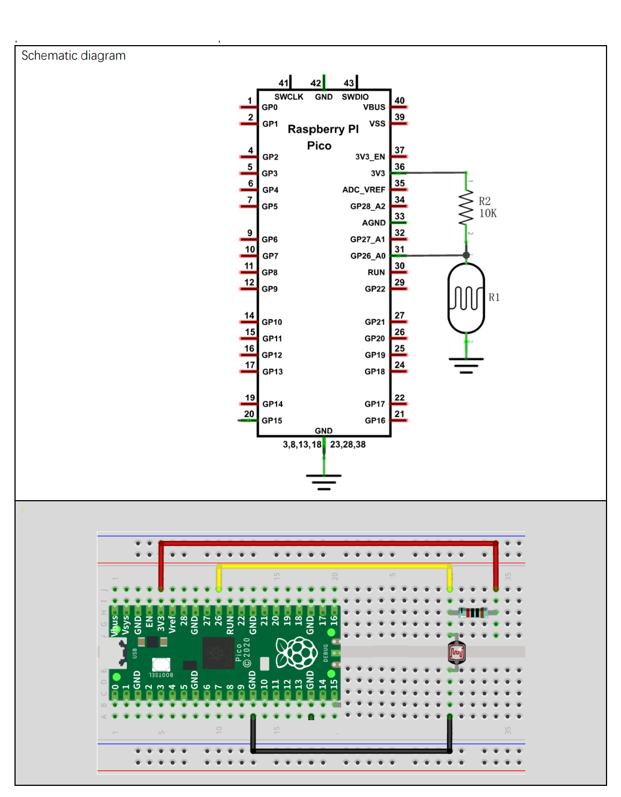
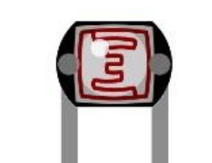

# Azure IoT Hub RPI Pico Thermistor

-   [Getting Started](#Getting-Started)
    
-   [Setup for the Thermistor](#Setup-for-the-Thermistor)

## About

This example addes a Themistor Temperature Sensor to generate  Telemetry data.

> Nb: THe SDK API is documented [here](https://azuresdkdocs.blob.core.windows.net/$web/c/az_iot/1.1.0-beta.2/index.html)

## Getting Started

- Get the Pico sending some simulated data as per the Base project ReadMe.

## Setup for the Thermistor
- Setup the WiFi and Azure IoT Hub connection in iot_configs.h as per the Base._ 
- Test Sketch:.
  - From he root of the Freenove clone locally,
    You might like to run Sketch_12.1_Temperature_and_Humidity_Sensor from ```Freenove_Ultimate_Starter_Kit_for_Raspberry_Pi_Pico-master\C\Sketches\Sketch_12.1_Thermometer``` in the cloned contents first to test the DHT11.
- Load the sketch here: ```Azure_IoT_Hub_RPI_Pico_Thermistor.ino```
- Verify the code

## Circuit



Note: The LDR from above looks like:



Ref: Freenove ```./C/C_Tutorial.pdf``` document (in repository) 

## Running
- Upload then switch to the Serial Monitor.
- Cover and uncover the LDR. Covered = higher value.
- You should see something like:
```
......WiFi connected, IP address: 192.168.0.14
Setting time using SNTP......done!
Current time: Sun Jan  1 07:42:57 2023
Client ID: PicoDev137
Username: PicoHub137.azure-devices.net/PicoDev137/?api-version=2020-09-30&DeviceClientType=c%2F1.5.0-beta.1(ard;rpipico)
MQTT connecting ... connected.
11252 RPI Pico (Arduino) Sending telemetry . . . {"msgCount":0,"value":76}
OK
13952 RPI Pico (Arduino) Sending telemetry . . . {"msgCount":1,"value":167}
OK
16609 RPI Pico (Arduino) Sending telemetry . . . {"msgCount":2,"value":166}
OK
18802 RPI Pico (Arduino) Sending telemetry . . . {"msgCount":3,"value":76}
OK
21552 RPI Pico (Arduino) Sending telemetry . . . {"msgCount":4,"value":128}
OK
24252 RPI Pico (Arduino) Sending telemetry . . . {"msgCount":5,"value":143}
OK
```

## Monitor Telemetry

### In a Terminal
- In a desktop terminal context that has AzureCli with the IoT Extensiomn installed (See Base ReadMe):  
```
az iot hub monitor-events --login <your Azure IoT Hub owner connection string in quotes> --device-id <your device id>
```

```
Starting event monitor, filtering on device: PicoDev137, use ctrl-c to stop...
{
    "event": {
        "origin": "PicoDev137",
        "module": "",
        "interface": "",
        "component": "",
        "payload": "{\"msgCount\":2,\"value\":176}"
    }
}
{
    "event": {
        "origin": "PicoDev137",
        "module": "",
        "interface": "",
        "component": "",
        "payload": "{\"msgCount\":3,\"value\":80}"
    }
}
{
    "event": {
        "origin": "PicoDev137",
        "module": "",
        "interface": "",
        "component": "",
        "payload": "{\"msgCount\":4,\"value\":141}"
    }
}
```

### In VS Code
- Add the Azure IoT Hub Extension
- Add The IoT Hub [Select and IoT Hub] and follow the directions.
  - You need to select the Subscription 
  - You will be prompted for connefction details
  - Then select the Hub
- In the left pane select the hub then the device.
- Right click on that and select "Start Monitoring Built-In Endpoint"

```
[IoTHubMonitor] Start monitoring message arrived in built-in endpoint for device [PicoDev137] ...
[IoTHubMonitor] Created partition receiver [0] for consumerGroup [$Default]
[IoTHubMonitor] Created partition receiver [1] for consumerGroup [$Default]
[IoTHubMonitor] Created partition receiver [2] for consumerGroup [$Default]
[IoTHubMonitor] Created partition receiver [3] for consumerGroup [$Default]
[IoTHubMonitor] [6:43:06 PM] Message received from [PicoDev137]:
{
  "msgCount": 3,
  "value": 76
}
[IoTHubMonitor] [6:43:09 PM] Message received from [PicoDev137]:
{
  "msgCount": 4,
  "value": 128
}
[IoTHubMonitor] [6:43:11 PM] Message received from [PicoDev137]:
{
  "msgCount": 5,
  "value": 143
}
[IoTHubMonitor] [6:45:21 PM] Message received from [PicoDev137]:
{
  "msgCount": 0,
  "value": 78
}
[IoTHubMonitor] [6:45:23 PM] Message received from [PicoDev137]:
{
  "msgCount": 1,
  "value": 79
}
```

## Code

The main code change here is to getTelemetryPayload() :
```
#include <ArduinoJson.h>

#define PIN_ADC0   26


static char* getTelemetryPayload()
{
    int adcValue = analogRead(PIN_ADC0);                            //read ADC pin
    doc["msgCount"]   = telemetry_send_count ++;
    doc["value"]   = map(adcValue, 0, 1023, 0, 255);
    serializeJson(doc, jsonStr);
    az_span temp_span = az_span_create_from_str(jsonStr);
    az_span_to_str((char *)telemetry_payload, sizeof(telemetry_payload), temp_span);

  return (char*)telemetry_payload;
}
```