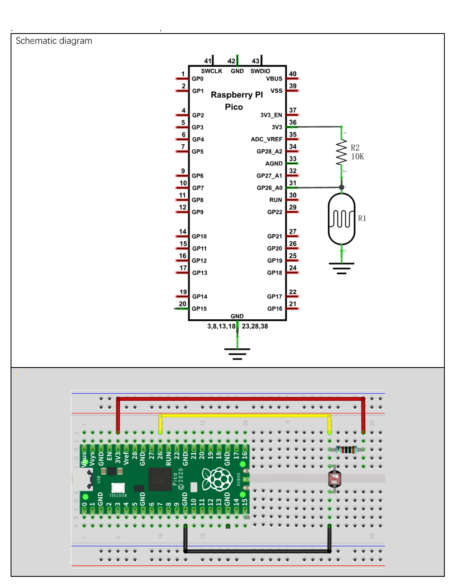

# Azure IoT Hub RPI Pico LDR

-   [Getting Started](#Getting-Started)
    
-   [Setup for the LDR](#Setup-for-the-LDR)

## About

This example addes Cloud to Device Method responses to the Themistor Temperature Sensor Telemetry Sketch..

> Nb: THe SDK API is documented [here](https://azuresdkdocs.blob.core.windows.net/$web/c/az_iot/1.1.0-beta.2/index.html)

## Setup for the LDR
- *Nb: Unchanged from the other Thermistor Sketch.*
- Setup the WiFi and Azure IoT Hub connection in iot_configs.h as per the Base._ 
- Test Sketch:.
  - From he root of the Freenove clone locally,
    You might like to run Sketch_11.1_Photosensitive from ```Freenove_Ultimate_Starter_Kit_for_Raspberry_Pi_Pico-master\C\Sketches\Sketch_11.1_Photosensitive``` in the cloned contents first to test the DHT11.
- Load the sketch here: ```Azure_IoT_Hub_RPI_Pico_LDR.ino```
- Verify the code

## Circuit

- *Unchanged*



Note: The LDR from above looks like:


Ref: Freenove ```./C/C_Tutorial.pdf``` document (in repository) 

## Running
- Upload then switch to the Serial Monitor.
- **This Sketch has the Telemetry stopped. See VS Code for how to start it first.**
- Cover and uncover the LDR. Covered = higher value.
- You should see something like:
```
......WiFi connected, IP address: 192.168.0.14
Setting time using SNTP......done!
Current time: Sun Jan  1 07:42:57 2023
Client ID: PicoDev137
Username: PicoHub137.azure-devices.net/PicoDev137/?api-version=2020-09-30&DeviceClientType=c%2F1.5.0-beta.1(ard;rpipico)
MQTT connecting ... connected.
11252 RPI Pico (Arduino) Sending telemetry . . . {"msgCount":0,"value":76}
OK
13952 RPI Pico (Arduino) Sending telemetry . . . {"msgCount":1,"value":167}
OK
```

### In VS Code
- Add the Azure IoT Hub Extension
- Add The IoT Hub [Select and IoT Hub] and follow the directions.
  - You need to select the Subscription 
  - You will be prompted for connefction details
  - Then select the Hub
- In the left pane select the hub then the device.
- Right click on that and select "Start Monitoring Built-In Endpoint"
- You will see nothing so far.
- Right Click on the Device in VS Code and select "Invoke Device Direct Method".


- In the popup (top in middle) enter start, press enter twice. (No payload)
- You should now see Telemetry in VS Code:
  - In VS Code Menu as above "Start Monitoring Built-In Event Endpoint"
- Telemetry should now be visiable in the Serial Terminal.

#### All Commands (CD Methods)
  - Note case sensitive
    - And only the first 4 characters matter.
  - start
    - No Payload
  - stop
    - No payload
  - frequency
    - Requires a payload.
    - After first return enter a period (in seconds) then press enter.
  - Toggle
    - Toggles the builtIn LED
    - Note that this also toggles with MQTT telemetry sends.
    - This could esily be a Cloud activated relay or other actuator.

#### Messages
- You can also send Messages to the device from the cloud.
- From the same menu as above.
- A single enter as no payload.
- The Serial terminal with show them but device does no further processing with them,


## Code

There are substantial code additions to handle the methods. See the .ino file.
See:
```
bool isNumeric(const char* s);
bool DoMethod(char * method, char * payload);
AZ_NODISCARD az_result az_span_relaxed_atou32(az_span source, uint32_t* out_number);
void receivedCallback(char* topic, byte* payload, unsigned int length)l
```