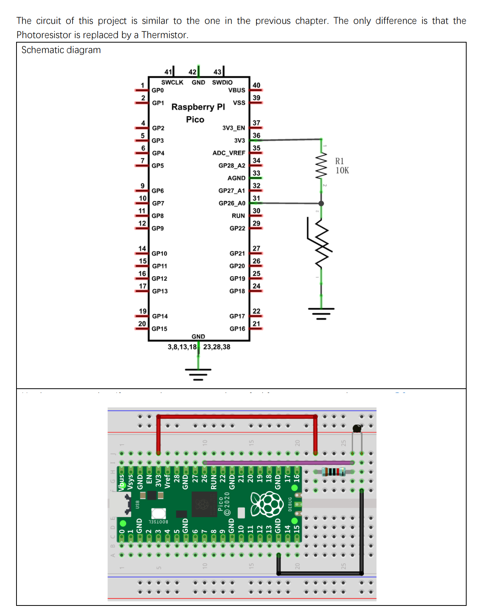

# Azure IoT Hub RPI Pico Thermistor

-   [Getting Started](#Getting-Started)
    
-   [Setup for the Thermistor](#Setup-for-the-Thermistor)

## About

This example addes a Themistor Temperature Sensor to generate  Telemetry data.

> Nb: THe SDK API is documented [here](https://azuresdkdocs.blob.core.windows.net/$web/c/az_iot/1.1.0-beta.2/index.html)

## Getting Started

- Get the Pico sending some simulated data as per the Base project ReadMe.

## Setup for the Thermistor
- Setup the WiFi and Azure IoT Hub connection in iot_configs.h as per the Base._ 
- Test Sketch:.
  - From he root of the Freenove clone locally,
    You might like to run Sketch_12.1_Temperature_and_Humidity_Sensor from ```Freenove_Ultimate_Starter_Kit_for_Raspberry_Pi_Pico-master\C\Sketches\Sketch_12.1_Thermometer``` in the cloned contents first to test the DHT11.
- Load the sketch here: ```Azure_IoT_Hub_RPI_Pico_Thermistor.ino```
- Verify the code

## Circuit



The thermistor is a small black blob component with two wires, like a resistor.

Ref: Freenove ```./C/C_Tutorial.pdf``` document (in repository) 

## Running
- Upload then switch to the Serial Monitor.
- You should see something like:
```
..........WiFi connected, IP address: 192.168.0.14
Setting time using SNTP.done!
Current time: Sun Jan  1 06:15:56 2023
Client ID: PicoDev137
Username: PicoHub137.azure-devices.net/PicoDev137/?api-version=2020-09-30&DeviceClientType=c%2F1.5.0-beta.1(ard;rpipico)
MQTT connecting ... connected.
8852 RPI Pico (Arduino) Sending telemetry . . . {"msgCount":0,"tempC":32.22362124,"tempK":305.3736212}
OK
11052 RPI Pico (Arduino) Sending telemetry . . . {"msgCount":1,"tempC":31.8461691,"tempK":304.9961691}
OK
13802 RPI Pico (Arduino) Sending telemetry . . . {"msgCount":2,"tempC":31.94035926,"tempK":305.0903593}
OK
16466 RPI Pico (Arduino) Sending telemetry . . . {"msgCount":3,"tempC":32.03466403,"tempK":305.184664}
```

## Monitor Telemetry

### In a Terminal
- In a desktop terminal context that has AzureCli with the IoT Extensiomn installed (See Base ReadMe):  
```
az iot hub monitor-events --login <your Azure IoT Hub owner connection string in quotes> --device-id <your device id>
```

```
Starting event monitor, filtering on device: PicoDev137, use ctrl-c to stop...
{
    "event": {
        "origin": "PicoDev137",
        "module": "",
        "interface": "",
        "component": "",
        "payload": "{\"msgCount\":13,\"tempC\":32.03466403,\"tempK\":305.184664}"
    }
}
{
    "event": {
        "origin": "PicoDev137",
        "module": "",
        "interface": "",
        "component": "",
        "payload": "{\"msgCount\":14,\"tempC\":31.94035926,\"tempK\":305.0903593}"
    }
}
{
    "event": {
        "origin": "PicoDev137",
        "module": "",
        "interface": "",
        "component": "",
        "payload": "{\"msgCount\":15,\"tempC\":31.94035926,\"tempK\":305.0903593}"
    }
}
```

### In VS Code
- Add the Azure IoT Hub Extension
- Add The IoT Hub [Select and IoT Hub] and follow the directions.
  - You need to select the Subscription 
  - You will be prompted for connefction details
  - Then select the Hub
- In the left pane select the hub then the device.
- Right click on that and select "Start Monitoring Built-In Endpoint"

```
[IoTHubMonitor] Start monitoring message arrived in built-in endpoint for device [PicoDev137] ...
[IoTHubMonitor] Created partition receiver [0] for consumerGroup [$Default]
[IoTHubMonitor] Created partition receiver [1] for consumerGroup [$Default]
[IoTHubMonitor] Created partition receiver [2] for consumerGroup [$Default]
[IoTHubMonitor] Created partition receiver [3] for consumerGroup [$Default]
[IoTHubMonitor] [5:15:59 PM] Message received from [PicoDev137]:
{
  "msgCount": 0,
  "tempC": 32.22362124,
  "tempK": 305.3736212
}
[IoTHubMonitor] [5:16:01 PM] Message received from [PicoDev137]:
{
  "msgCount": 1,
  "tempC": 31.8461691,
  "tempK": 304.9961691
}
[IoTHubMonitor] [5:16:03 PM] Message received from [PicoDev137]:
{
  "msgCount": 2,
  "tempC": 31.94035926,
  "tempK": 305.0903593
}
```

## Code

The main code change here is to getTelemetryPayload() :
```
#include <ArduinoJson.h>

#define PIN_ADC0   26


static char* getTelemetryPayload()
{
    int adcValue = analogRead(PIN_ADC0);                            //read ADC pin
    double voltage = (float)adcValue / 1023.0 * 3.3;                // calculate voltage
    double Rt = 10 * voltage / (3.3 - voltage);                     //calculate resistance value of thermistor
    double tempK = 1 / (1 / (273.15 + 25) + log(Rt / 10) / 3950.0); //calculate temperature (Kelvin)
    double tempC = tempK - 273.15;                                  //calculate temperature (Celsius)
    doc["msgCount"]   = telemetry_send_count ++;
    doc["tempC"]   = tempC;
    doc["tempK"]   = tempK;
    serializeJson(doc, jsonStr);
    az_span temp_span = az_span_create_from_str(jsonStr);
    az_span_to_str((char *)telemetry_payload, sizeof(telemetry_payload), temp_span);

  return (char*)telemetry_payload;
}
```