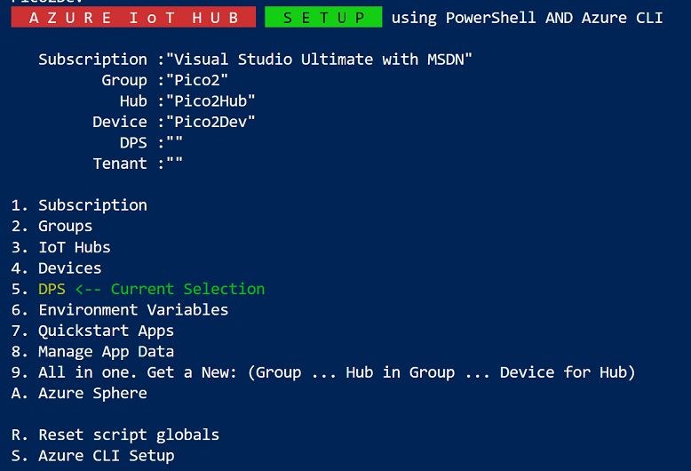

# Azure IoT Hub Arduino Raspberry Pi Pico with Telemetry

# Light Sensor CD SKETCH IS A WORK IN PROGRESS
Have Direct Methods, CD Messages, Patches, Twins and Desired/Reported Properties.  
Refactoring all bar Messages into separate source files.
2Do: One Sketch for all with this functioanlity as above
     Then option in specific telemetry hardware.

## About
Adds some functioanlity, such as reading environment telemetry to [Azure/azure-sdk-for-c-arduino](https://github.com/Azure/azure-sdk-for-c-arduino) Rpi Pico example. This example has been added as a Pull Request to that repository which was pulled from the fork at [djaus2/azure-sdk-for-c-arduino](https://github.com/djaus2/azure-sdk-for-c-arduino). The first Sketch here (base) is that same proposed example Sketch and is in  ```examples/Azure_IoT_Hub_RPI_Pico``` in the djaus2 fork. (When merged in the origninal, it should be in the matching folder).

## Hardware
Using a Freenove Ultimate Starter Kit and Rpi Pico. See the ReadMe in the Base for further info.

## Sketches
- Azure_IoT_Hub_RPI_Pico_Base
  - The base version. Work through the ReadMe there to get the Pico up and running with Azure IoT Hub
  - It also includes an addendum for porting the ESP8266 example to the Pico, from the original repository.
  - Only sends an incremented count as telemetry.
- Azure_IoT_Hub_RPI_Pico_DHT11
  - Reads a DHT11 sensor and sends Temperature and Pressure as Telemetry.
  - Makes use of formal generation of Json string.
  - This is a template for other sensors.
- Azure IoT Hub RPI Pico LDR
  - Reading light intensity using a Light Dependent Resistor (LDR)  as per the DHT11 template.
- Azure_IoT_Hub_RPI_Pico_Thermistor
  - A Thermistor temperature sensor as per the DHT11 template.
  - Circuit and code quite similar to the LDR.
 - Azure_IoT_Hub_RPI_Pico_BME280 *Coming*
 - Azure IoT Hub RPI Pico LDR with Cloud to Device Messages and Commands
   - Messages: All Sketches will display Cloud to Device Messages to it. Unchanged
     - Custom CD Msg feedback is a work in progress.
   - This version will interpret a number of Cloud to Device Commands (Methods) and run them. Added
     - Now sends acknowledgment back to the cloud.
 - CS_CDMessagesIoTHub
   - A C# Console app to test sending a Cloud To Device Message
   - Have logged an issue with Azure IoT Explorer: "[BUG] Unexpected end of JSON - CD Message #598" 
   - Sending CD Messages from this app and sending CD Messages from VS Code don't get that error.
   - Work in progress wrt Message Replies/Feedback
     - This app displays Feedback but thus far not able to customise..
 
## 2Do
 - Handle ~~CD Messages~~, ~~Methods~~, Properties etc.

## Setting up the IoT Hub

I have another repository that when cloned and opened in VS Code provides a menu driven context for creating 
and managing an Azure IoT Hub and releated entities. See:

[Azure IoT Hub PowerShell Scripts](https://github.com/djaus2/az-iothub-ps)

- Get an Azure Subscription (You can get a free one for a month or so).
- Clone the above repository and open the PS folder in VS Code and from a terminal run:

```
./get-iothub
```

> **New:** Can generate C Header File Device connectivity for Azure SDK for C Arduino:  
In get-iothub, Menu 6 then 1. Info at bottom.



= Select the subscription and login
- Create a new Group
- Create a new IoT Hub
- Create a new Device
- Get the Connectivity details ***(6. Environment Variables)***
  - Menu Option 6 then 1. Info at bottom.  
Copy and paste into header file

